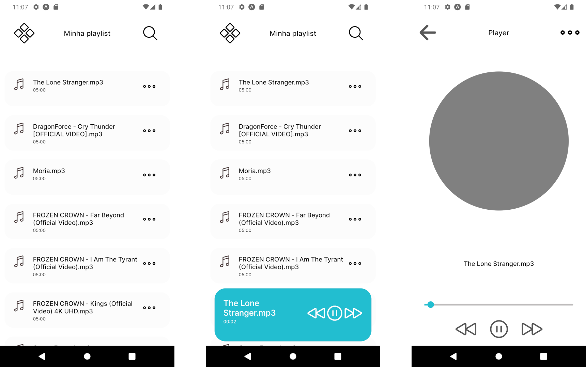

    
  
  
    

<h1 align="center">
    PipMusic
</h1>

  PipMusic é um player de musica que se integra com Google Drive. Com ele é possível se comunicar com musicas em uma pasta compartilhada no drive.

  

 
 

  

## Download
<!-- Obtenha o app na página [releases](https://github.com/rajarsheechatterjee/LNReader/releases). -->

## Sobre

O PipMusic é desenvolvido por um fã de tecnologias e inovação e que gosta de programar. O objetivo principal desse projeto foi de aprendizado na área de desenvolvimento mobile e ReactNative, portanto nada melhor do que aprender fazendo algo que é útil para sí próprio e até mesmo ajudar a comunidade.

## Licensa
[MIT ](https://github.com/LucasJordi/jupiterln/LICENSE)

## Contribua
O desenvolvedor ainda é novato e deseja aprender e ter mais desafios!

Se tem alguma crítica, sugestão ou quer ajudar o projeto então você é mais que bem vindo!

contato: lucasjordisilva@gmail.com

